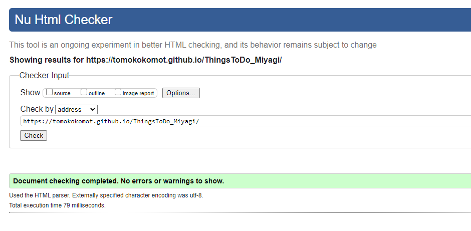
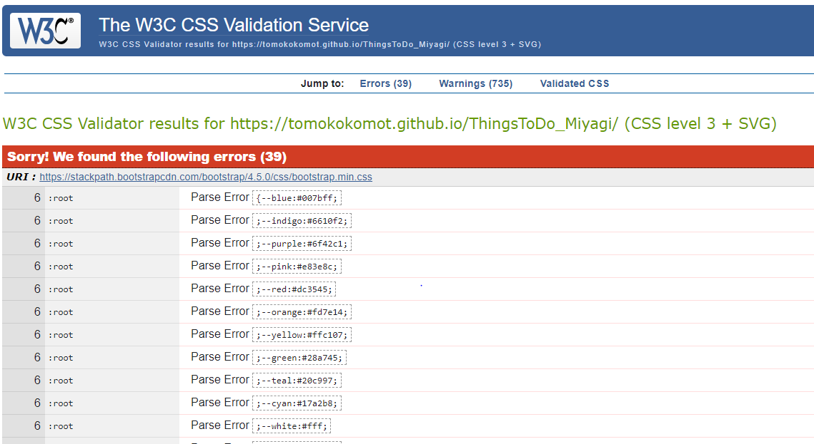

# Come n Play Miyagi

[This project](https://tomokokomot.github.io/ThingsToDo_Miyagi/) is created for my second milestone project for Code Institute to showcase what I have learned from Interactive Frontend Development course , 
creating a responsive and interactive website using HTML, CSS and JavaScript and designed for those who would like to explore Miyagi Prefecture, 
located in the north east of Japan, and to offer useful tourist information, such as some activites and attractions to help users' travel decisions.

 
## UX

This site is designed to provide useful tourist information about Miyagi Prefecture where I come from. 
It may be reflected by my own personal experience but yet the goal of this site is 
to achieve an interactive and responsive website that users can easily navigate themselves across the site. 
The users can be redirected to external website for more details for their choice of activities.

### Site owner’s goals

- To encourage people to visit Miyagi and help to boost local businesses
- To have return customes, offering user friendly interactive and simple and clear website
- To help users make a decision for holiday destinations

### User stories

- As a first-time visitor, I expect the website will be simple and straightforward to find locations of activities.
- As a parent, I would like to find out about family-friendly places or places that both adults and children can enjoy at the same time.
- As a residence of Miyagi prefecture, I would like to know more about what other cities and towns offer.
- As a user, I should be able to use the filter of a type activities that I am looking for. 

### Design

This wireframe was made with MockFlow. The link below take you to PNG file.
- [wireframes](wireframe/wireframe.png)

## Features
 
### Existing Features
- A responsive navigation bar that changes to a hamburger menu with dropdown menu on smaller screen on each page. 
- a Bootstrap Carousel feature that loops through a montage of photo to grab attention from a user
- A filter function on Activities page to help users to find activities that they are looking for. If you type the name of the activity, the table collapses and only appear the activity and places that you type.
- Google Map with markers and info widows for users to locate activities easily. Wen you click a makrker, an info window pops up with the name of teh place.
- A contact form which allows users to interact the site owner. the name of the activity, the table collapses and only appear the activity and places that you type.
- Footer: each social media icon has a link and navigates you to each website.

### Features Left to Implement
In the future I would like to add below the followings which I think it would be beneficial for the website 
to have more traffic;

1. Sightseeing page
2. Adding more activities or places
3. Food page (ex: introduction of local delicacies)
4. Trip suggestions
5. Google Map markers with info windows: After so many tries and advices, I coudln't figure out to a probelm I had to set the info windows.
   I would liek to Implement as soon as my skill is improved.
   

## Technologies Used

1. HTML5: Used for structuring and presenting content on the website.
2. CSS3: Used to style the website.
3. jQuery & JavaScript: Used with Bootstrap to collaspe Navigation Bar and Google Map
4. Bootstrap: A frontend framework to build a responsive and mobile-first website and get support for JavaScript plugins.
5. GitHub: Used to create and store the source code for the project.
6. EmailJS Service: Allows sending email directly from Javascript.
7. MockFlow: For creating a wireframe to generate my idea for this project. 

## Testing

### HTML Validator
The W3C Markup Validation Service has been used. The result can be seen in the image below.

### CSS Validator
The W3C CSS Validation Service has been used. The result comes back with errors but it is clear that all the CSS errors come from the Bootstrap framework.

### JavaScript Validation 
JSLint: there were no errors that needed to be changed and the javascript passed general standards.

## Deployment

This project was created using GitHub. I used Gitpod.io to write my code. Then I used git commit followed by pushes to my GitHub repository.
As the final step, I've deployed this project to GitHub Pages from the GitHub repository using the following steps.

### How to deploy the side

- Log in to GitHub.
- From the list of the repositories, select ThinkgsToDo_Miyagi.
- From the menu, click on the Settings.
- Scroll down to the GitHub Pages section, select Master Branch from the dropdown menu.
- The page will automatically refresh.
- The website is deployed, you can find the link just under the GitHUb pages, hilighted green.
 
### How to deploy locally
If you want to clone this project and run locally, you need to do the following:

- Follow this link to [my repository](https://github.com/TomokokomoT/ThingsToDo_Miyagi).
- Click on the Clone or download button.
- Copy the clone URL.
- In your local IDE open Git Bash.
- Change the current working directory to the location where you want the cloned directory to be made.
- Type git clone and paste the URL you copied from the Clone or download section.
- Press Enter to create your local clone.

## Credits

### Content (external links)
- In About Miyagi section, the link to [2011 Tohoku Great Eathquake](https://en.wikipedia.org/wiki/2011_T%C5%8Dhoku_earthquake_and_tsunami) was provided to introduce more detail about the event.
- In Activities page, each activity has also a external link to website to find out more details such as access, location and so on.

### Acknowledgements

Big thank-you to my mentor, Rohit Sharma and COde Institute's tutor team. I could not built the website without their help.

The images used in teh project were taken from;
- image of Matsushima from http://www.town.miyagi-matsushima.lg.jp/
- image of Zao from [Ryoting](https://www.photo-ac.com/profile/1219666)
- image of Naruko from [AtelierHIROKO]("https://www.photo-ac.com/profile/1659789")  
- image of Daruma from [kimkimkaoru](https://www.ac-illust.com/main/profile.php?id=iQU9u3wV&area=1)   
- image of Sunflower field [b*******m](https://www.photo-ac.com/profile/2813493)     